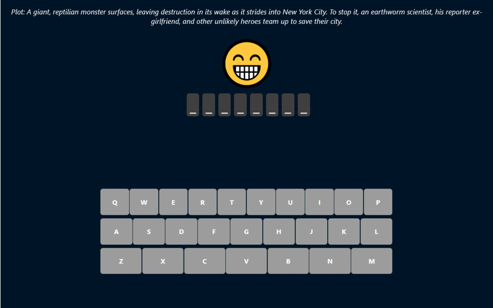

## Description

This app was a practice to use ReactJS main features as well as learn how to consume APIs with ReactJS.

## Key Features
1. A random movie is fetched from the API
2. The description is displayed to help the user guess the name of the movie
3. If the player chooses a character that is not part of the name the emoji loses a life point
4. The game end once the emoji dies or the name of the movie is guessed
## Technologies/Tools

- ReactJS
- Html
- Css
- Movie API

## Afterthoughts
This was one of my first ReactJS project it was a good practice and in the future I want to implement a better UI, a reset button and change the Css since is a bit of a mess.
